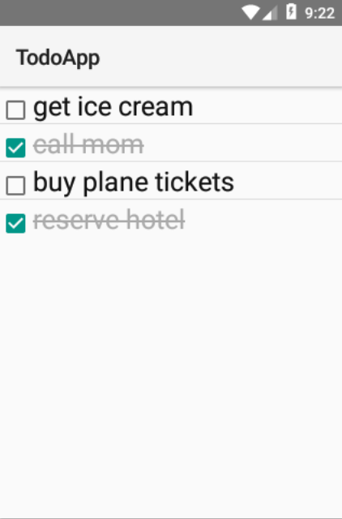

TodoApp
=======

**NOTE:** this is under development, not functionaly yet

A simple To-Do list app

## How to run in development

Ensure that you have [Android SDK](https://developer.android.com/studio/index.html#downloads) installed.

Install the Python development requirements:

    pip install -r requirements-dev.txt

[Plug in your Android device](https://developer.android.com/training/basics/firstapp/running-app.html) or [start an emulator](https://developer.android.com/studio/run/emulator-commandline.html).

Build and run the app:

    python setup.py android --start

